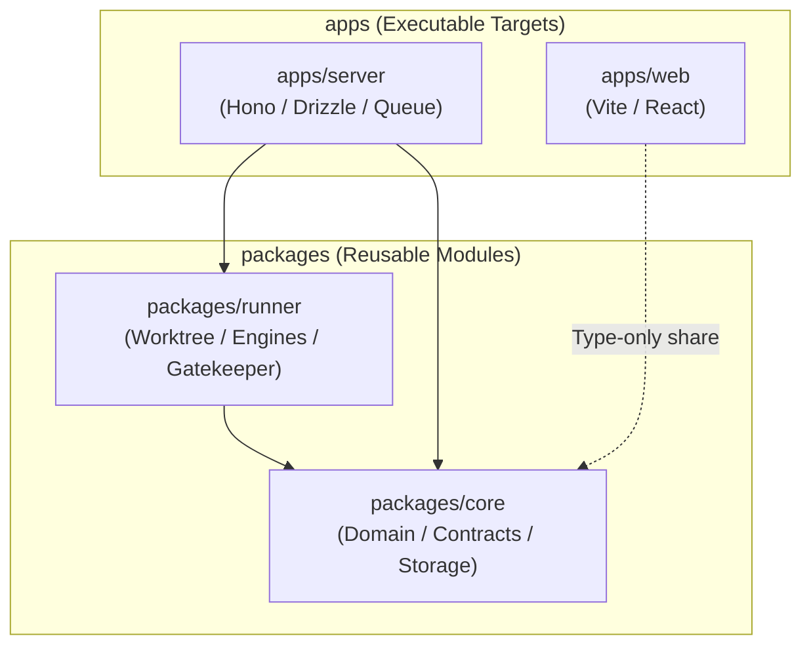

# AGENTS.md

This document defines common rules, behavioral guidelines, and operational standards for AI coding agents (Antigravity, Claude Code, Cursor, etc.) working autonomously on `kuramori`.

---

## 1. Project Overview

`kuramori` (蔵守) is an automated review management platform that detects Pull Requests on GitHub, performs pre-emptive deep reviews inside isolated Git worktrees, orchestrates multiple AI engines (Claude Code, Antigravity, Codex, Local LLMs), and generates structured reports with D2 vector diagrams (dependency graphs and StepFlow).

---

## 2. Deterministic Command System

Always use the deterministic `deno task` commands to verify changes rather than running raw shell commands.

| Command | Purpose |
| :--- | :--- |
| `deno task check` | TypeScript type-check across all packages and apps |
| `deno task test` | Execute the entire test suite (70+ tests) |
| `deno task build` | Production build of the web frontend (Vite + React) |
| `deno task dev:server` | Start backend server with file watch mode (`http://localhost:3456`) |
| `deno task dev:web` | Start frontend Vite HMR development server |
| `deno task runner --repo <owner/repo> --pr <num>` | Run standalone review runner script |

---

## 3. Architecture Boundaries and Absolute Constraints

This project uses a Deno 2 monorepo structure. Follow these dependency rules **strictly** (see [docs/architecture.md](docs/architecture.md) for full details).

- **`packages` ➔ `apps` imports are strictly forbidden**: Reusable packages (`core`, `runner`) must never depend on concrete applications (`server`, `web`).
- **Adhere to boundary contracts**: All interactions with external services (VCSProvider, ReviewEngine, ReportStorage) must go through abstract interfaces defined in `@kuramori/core`.
- **Worktree isolation**: Never run reviews in the main workspace tree. Always use temporary worktrees managed by `WorktreeManager`, ensuring clean removal after completion.

---

## 4. Coding & Quality Standards

- **Eliminate unnecessary type assertions**: Avoid `as` (including `as const`) whenever type inference suffices. Maximize type inference.
- **Explicit `undefined` guards**: Avoid `!` non-null assertions. Use explicit guards such as `if (val === undefined)`.
- **Structured logging**: Never interpolate values using template literals in log messages. Pass context objects instead (e.g., `logger.error("failed to process", { id })`).
- **Markdown URL links**: Always format URLs using markdown links `[link text](URL)`. Never leave raw URLs or wrap formatting tags outside links improperly.
- **Comment scope**: Document only the declaration's own definition and responsibility. Do not document work history, caller references, future plans, or issue tracking IDs.

---

## 5. Documentation Map (Specification Locations)

Consult the following documents using `view_file` when specific domain knowledge is needed:

| Topic | Reference Document |
| :--- | :--- |
| **Documentation Index** | [docs/README.md](docs/README.md) |
| **Core Concepts & Background** | [docs/concept.md](docs/concept.md) |
| **Monorepo Architecture & Layers** | [docs/architecture.md](docs/architecture.md) |
| **SQLite Data Model & Job States** | [docs/data-model.md](docs/data-model.md) |
| **AI Engines (Claude, Antigravity, Codex)** | [docs/engines.md](docs/engines.md) |
| **Rules, Triggers & 4-Block Prompts** | [docs/rules-and-triggers.md](docs/rules-and-triggers.md) |
| **REST API Reference & OpenAPI** | [docs/api.md](docs/api.md) |
| **Operations & Troubleshooting** | [docs/operations.md](docs/operations.md) |
