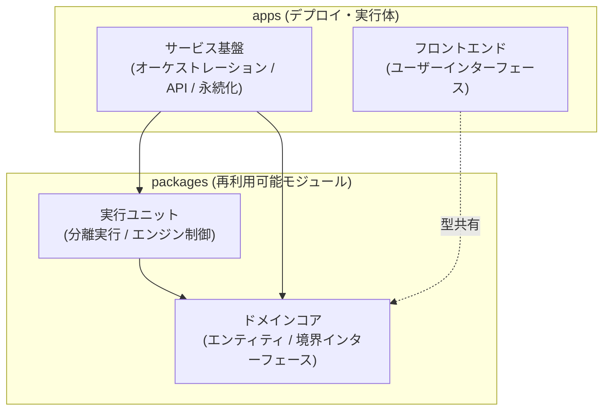
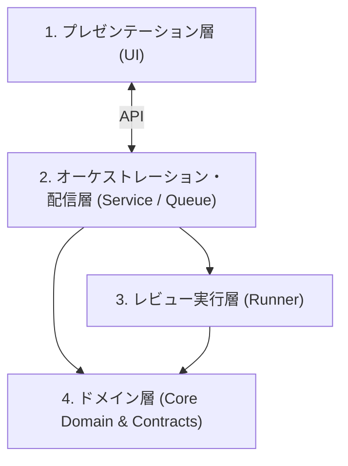
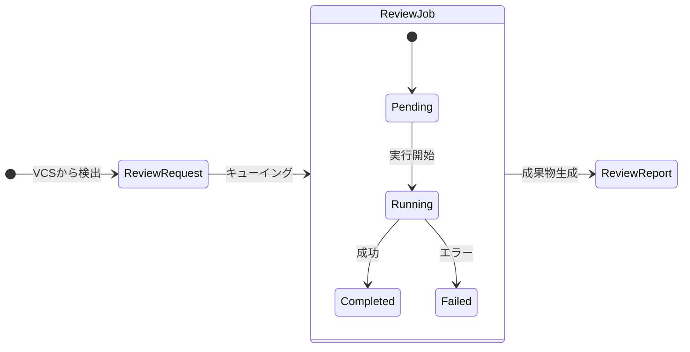

# アーキテクチャ設計書

本ドキュメントでは、`review-base` の不変的な設計思想、モジュール境界、およびシステムを構成する中核の概念を定義する。特定のライブラリや一時的な実装詳細に依存せず、開発の進展に伴う変化に耐えうる基本構造を記述する。

---

## 1. アーキテクチャ原則

1. **依存の一方向性 (Unidirectional Dependency)**
   高水準のビジネスルール（ドメイン概念）は、低水準の詳細（永続化技術、フレームワーク、UI）に依存しない。依存は常に外側の具象から内側の抽象に向かって流れる。
2. **抽象による外部境界の遮蔽 (Interface Segregation)**
   VCS（バージョン管理システム）、レビュー実行機構（AI エンジン）、ストレージ（レポート保管）などの外部環境と接する境界はすべて抽象インターフェースで定義し、実行環境に応じた差し替えを可能にする。
3. **配布形態の柔軟性 (Execution Portability)**
   常駐型の Web サービスとしての実行と、CI や開発環境における単発の CLI ツールとしての実行の両方を、同一のコアロジックを共有したまま実現できるように設計する。

---

## 2. ワークスペース構造概念 (Workspace Boundaries)

本プロジェクトはモノレポ（Workspace）として構成されており、コードを **「apps」** と **「packages」** の2つの明確な概念境界に分類する。

### 2.1 `apps` (Applications / Execution Targets)
- **概念定義**: 単独で起動、デプロイ、またはホスティングされる「実行の終端（Entrypoint）」。
- **責務**:
  - ランタイム環境の初期化、設定の読み込み、依存オブジェクトの解決と組み立て（Composition Root）。
  - 外部ネットワークからのリクエスト受付（HTTP、WebSocket、UI インタラクション）。
  - 他のモジュールからライブラリとしてインポートされることはない。

### 2.2 `packages` (Shared Modules / Reusable Units)
- **概念定義**: 特定の実行基盤やフレームワークから独立した「再利用可能な共有ロジック・契約」。
- **責務**:
  - ドメインモデル、ビジネスエンティティ、抽象インターフェースの定義。
  - 特定の実行形態（CLI 実行、ライブラリ呼び出し）に依存しない純粋な実行機能の提供。
  - `apps` や他の `packages` から呼び出されるライブラリとして振る舞い、自律した常駐プロセスを持たない。

### 2.3 依存規則
- **`apps` ➔ `packages`**: 許可。アプリケーションは必要なパッケージを組み合わせてシステムを構築する。
- **`packages` ➔ `apps`**: **厳禁**。共有パッケージが特定のアプリケーション層に依存してはならない。
- **`packages` ➔ `packages`**: 一方向のみ許可。より高水準・具象的なパッケージが、基底となるドメインパッケージに依存する。

---

## 3. レイヤー構成と責務

システムは以下の 4 つの論理層によって構成される。

### 1. プレゼンテーション層 (UI)
- 変更要求（Pull Request）のステータス、レビュー進捗、および評価結果をユーザーに可視化する。
- 直感的なクエリ操作やフィルタリングを提供し、多数のレビュー対象を効率的にトリアージする。

### 2. オーケストレーション・配信層 (Service / Queue)
- VCS からの変更検知（ポーリングやイベント受信）を行い、レビュー実行のタスクをキューイングする。
- 実行リソースの制約に応じた並列制御、状態管理、エラー時のリカバリを司る。
- 蓄積されたレビューデータおよび成果物をプレゼンテーション層に配信する。

### 3. レビュー実行層 (Runner)
- 隔離された作業環境（一時ツリー）を構築し、対象の変更差分を安全に展開する。
- 設定された AI レビューエンジンへコンテキストを渡し、レビューの実行・結果のパース・成果物の構築を行う。
- 実行環境の汚れを後に残さないクリーンアップの責務を持つ。

### 4. ドメイン層 (Core Domain & Contracts)
- システム全体で共有される不変の概念（変更要求、レビュー実行、レポート）の定義。
- 外部システム（VCS、エンジン、永続化ストレージ）との通信規約（契約）の定義。

---

## 4. コアエンティティとライフサイクル

システム内を流通する主要なエンティティとその状態関係。

- **ReviewRequest (変更要求)**:
  - VCS 上の Pull Request / Merge Request を表現するエンティティ。
  - レビュー対象のメタデータ（リポジトリ、ブランチ、コミット、差分状態）を保持する。
- **ReviewJob (レビュー実行単位)**:
  - 特定の ReviewRequest に対して実施される個別のレビュー試行。
  - 状態（待機中、実行中、完了、失敗）、使用された実行エンジン、開始・終了時刻、エラー情報を記録する。
- **ReviewReport (評価レポート)**:
  - 正常終了した ReviewJob の成果物。
  - 総合判定（承認、要変更、コメント等）、要約、および詳細なレポートコンテンツを保持する。

---

## 5. 境界インターフェース契約 (Boundary Contracts)

外部システムとの結合部はすべて抽象化され、コアロジックを修正することなく差し替え可能とする。

### 5.1 VCS 境界 (VCS Provider)
- **役割**: 対象コードベースの取得およびメタデータ操作の抽象化。
- **責務**:
  - 変更要求の一覧および詳細情報の取得。
  - 変更差分（diff）およびコード取得用エンドポイントの提供。
  - 具体的な VCS（GitHub、GitLab、ローカルリポジトリ等）の実装差異を隠蔽する。

### 5.2 エンジン境界 (Review Engine)
- **役割**: AI エージェントや解析ツールを用いたレビュー実施機構の抽象化。
- **責務**:
  - 隔離環境内のコードと差分を受け取り、所定のプロンプトや解析ルールに基づいて診断を実施。
  - 診断結果をパースし、統一されたフォーマット（判定、要約、成果物ファイル）として返却する。
  - エンジンの種類（各種 AI CLI、API 直接呼び出し、ルールベース静的解析）の実装差異を隠蔽する。

### 5.3 ストレージ境界 (Report Storage)
- **役割**: レビュー成果物の永続化および取得の抽象化。
- **責務**:
  - レポート成果物の保存、存在確認、および読み出し。
  - 保存先（ローカルファイルシステム、オブジェクトストレージ、インメモリストア）の差異を隠蔽する。

---

## 6. 将来の適応性と進化可能性 (Evolutionary Architecture)

システムは初期の単一開発者向け環境から、チーム共有・常駐サービスへと滑らかにスケールできるよう以下の進化余地を設計に織り込んでいる。

1. **実行形態の分離**:
   コア実行ロジックは独立したパッケージとして存在するため、中央サーバーからの非同期実行だけでなく、ローカル CLI や CI パイプラインへの組み込みが可能。
2. **永続化技術の非拘束**:
   ドメインモデルは特定のデータベース仕様と疎結合に保たれており、組み込みデータベースから外部マネージドデータベースへの移行が容易。
3. **外部トリガーの抽象化**:
   タスクの登録口は一元化されており、定期ポーリング方式から Webhook によるプッシュ駆動への移行、あるいはユーザーによる手動トリガーの混在を透過的に扱える。
