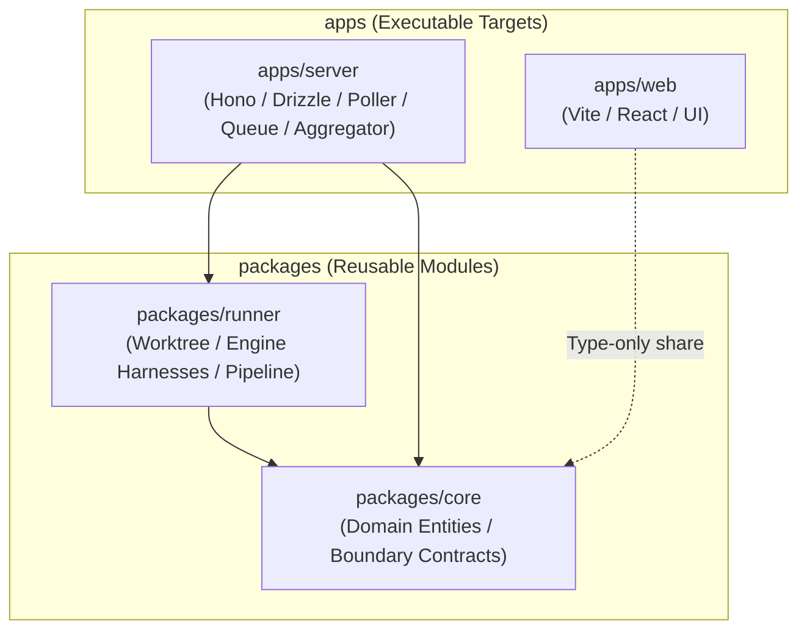
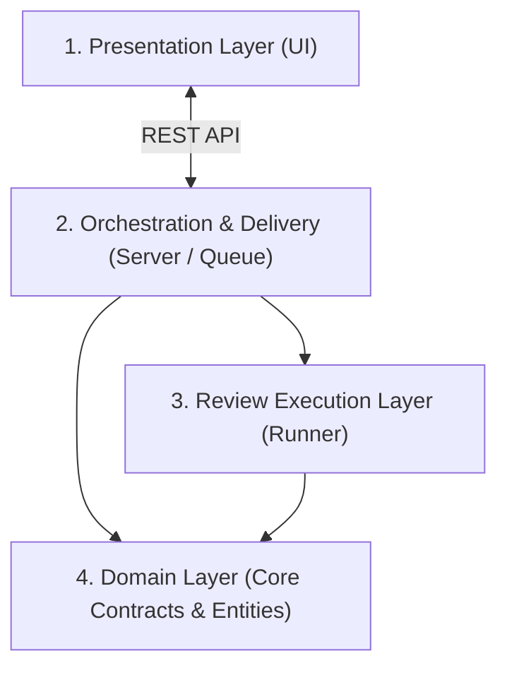

# Architecture Design Document

This document defines the foundational design principles, module boundaries, and core concepts of `kuramori`. It describes structural relationships that remain stable independent of ephemeral implementation details.

---

## 1. Architectural Principles

1. **Unidirectional Dependency**: High-level domain rules must not depend on low-level details (persistence, frameworks, UI). Dependencies flow strictly from outer concrete layers toward inner abstractions.
2. **Interface Segregation at Boundaries**: Boundaries interacting with external systems (VCS, AI engines, report storage) are defined via abstract interfaces, allowing seamless swapping of implementations.
3. **Execution Portability**: Core execution logic is shared identically whether running as a persistent web service or as a standalone CLI tool.

---

## 2. Workspace Boundaries (Monorepo Layout)

The codebase is organized as a Deno 2 monorepo workspace divided into two distinct conceptual zones: **`apps`** and **`packages`**.

### 2.1 `apps` (Applications / Execution Targets)
- **Definition**: Entry points that initialize runtimes, load configurations, and assemble dependencies (Composition Root).
- **Responsibilities**:
  - Accept external network requests (HTTP, WebSocket, UI interactions).
  - Never imported as libraries by other packages.

### 2.2 `packages` (Shared Modules / Reusable Units)
- **Definition**: Reusable business logic, contracts, and execution units independent of application hosting frameworks.
- **Responsibilities**:
  - Define domain entities and abstract interfaces (`core`).
  - Provide pure execution logic without long-running daemons (`runner`).
  - Act as libraries for `apps`.

### 2.3 Dependency Rules
- **`apps` ➔ `packages`**: Allowed. Applications assemble packages to build systems.
- **`packages` ➔ `apps`**: **Strictly forbidden**. Reusable packages must never depend on application layers.
- **`packages` ➔ `packages`**: Unidirectional only (`runner` ➔ `core`).

---

## 3. Four-Tier Layer Responsibilities

1. **Presentation Layer (`apps/web`)**: Visualizes PR status, review progress, and interactive reports with D2 diagrams and StepFlows.
2. **Orchestration & Delivery Layer (`apps/server`)**: Monitors VCS, queues review jobs, coordinates concurrency, aggregates multi-rule results (verdict resolution, finding re-indexing, D2 diagram consolidation, `appliedRules`), and delivers reports via REST API and OpenAPI.
3. **Review Execution Layer (`packages/runner`)**: Spawns isolated Git worktrees, collects context, executes AI review engines, runs Gatekeeper verification, and renders D2 diagrams.
4. **Domain Layer (`packages/core`)**: Defines shared data structures, Zod 4 schemas, and boundary contracts.

---

## 4. Boundary Contracts

All external interactions are shielded by abstract interfaces in `@kuramori/core`:

- **VCS Boundary (`VCSProvider`)**: Abstracts pull request fetching, diff extraction, and commit metadata.
- **Engine Boundary (`ReviewEngine`)**: Abstracts AI agent harnesses (Claude Code, Antigravity, Codex, Mock).
- **Storage Boundary (`ReportStorage`)**: Abstracts persistence and retrieval of review reports (HTML/JSON).
