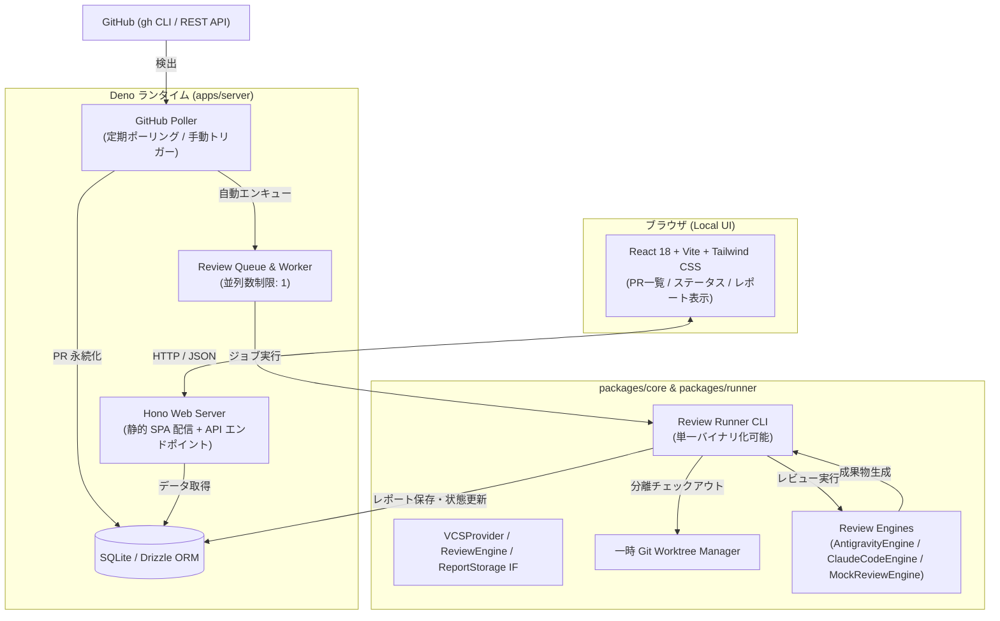

# アーキテクチャ設計書

## 1. システム全体構成



## 2. モノレポ構造 (Deno 2 Workspace)

```text
review-base/
├── deno.json                  # ルートワークスペース定義・共通タスク
├── packages/
│   ├── core/                  # ドメイン型・抽象インターフェース
│   │   ├── src/
│   │   │   ├── types/         # ReviewRequest, ReviewJob, ReviewReport
│   │   │   ├── interfaces/    # VCSProvider, ReviewEngine, ReportStorage
│   │   │   ├── storage/       # LocalFileReportStorage
│   │   │   └── vcs/           # GitHubProvider
│   │   └── deno.json
│   └── runner/                # レビュー実行 CLI (Deno/TS, 単一バイナリ化可能)
│       ├── src/
│       │   ├── worktree.ts    # WorktreeManager
│       │   ├── engines/       # ClaudeCodeEngine
│       │   └── cli.ts         # CLI エントリーポイント
│       └── deno.json
├── apps/
│   ├── server/                # Hono Web サーバー & ジョブキュー
│   │   ├── src/
│   │   │   ├── db/            # Drizzle スキーマ・SQLite 初期化
│   │   │   ├── poller.ts      # GitHubPoller
│   │   │   ├── queue.ts       # ReviewQueue
│   │   │   ├── api.ts         # Hono API ルート
│   │   │   └── index.ts       # サーバーブートストラップ・SPA 配信
│   │   └── deno.json
│   └── web/                   # Vite + React ダッシュボード
│       ├── src/
│       │   ├── App.tsx        # メインダッシュボード UI
│       │   └── main.tsx
│       ├── package.json
│       ├── vite.config.ts
│       └── deno.json
├── data/                      # 永続化データ (SQLite DB, レポート HTML)
└── docs/                      # 設計・コンセプトドキュメント
```

## 3. データモデル (SQLite / Drizzle ORM)

### 3.1 `review_requests`
| カラム名 | 型 | 制約 | 説明 |
| :--- | :--- | :--- | :--- |
| `id` | TEXT | PRIMARY KEY | 一意の識別子 (`${provider}:${repo}#${number}`) |
| `user_id` | TEXT | NOT NULL, DEFAULT 'default' | 所有ユーザーID (将来のサーバー化対応) |
| `provider` | TEXT | NOT NULL, DEFAULT 'github' | VCS プロバイダ名 |
| `repository` | TEXT | NOT NULL | リポジトリ名 (`owner/repo`) |
| `number` | INTEGER | NOT NULL | PR 番号 |
| `title` | TEXT | NOT NULL | PR タイトル |
| `author` | TEXT | NOT NULL | 作成者アカウント |
| `url` | TEXT | NOT NULL | PR Web URL |
| `source_branch`| TEXT | NOT NULL, DEFAULT '' | 送信元ブランチ名 (headRef) |
| `target_branch`| TEXT | NOT NULL, DEFAULT '' | マージ先ブランチ名 (baseRef) |
| `head_sha` | TEXT | NOT NULL, DEFAULT '' | 先頭コミットハッシュ |
| `is_draft` | INTEGER | NOT NULL, DEFAULT 0 | ドラフトフラグ |
| `state` | TEXT | NOT NULL, DEFAULT 'open' | ステータス (`open`, `closed`, `merged`) |
| `created_at` | TEXT | NOT NULL | 作成日時 (ISO 8601) |
| `updated_at` | TEXT | NOT NULL | 更新日時 (ISO 8601) |

### 3.2 `review_jobs`
| カラム名 | 型 | 制約 | 説明 |
| :--- | :--- | :--- | :--- |
| `id` | TEXT | PRIMARY KEY | ジョブ UUID |
| `request_id` | TEXT | NOT NULL, REFERENCES review_requests(id) | 対象 PR の ID |
| `user_id` | TEXT | NOT NULL, DEFAULT 'default' | 所有ユーザーID |
| `status` | TEXT | NOT NULL, DEFAULT 'pending' | 状態 (`pending`, `running`, `completed`, `failed`) |
| `engine` | TEXT | NOT NULL, DEFAULT 'claude-code' | 実行エンジン名 |
| `started_at` | TEXT | NULLABLE | 実行開始日時 |
| `completed_at`| TEXT | NULLABLE | 実行完了日時 |
| `error` | TEXT | NULLABLE | 失敗時のエラーメッセージ |
| `report_id` | TEXT | NULLABLE | 紐づくレポート ID |

### 3.3 `review_reports`
| カラム名 | 型 | 制約 | 説明 |
| :--- | :--- | :--- | :--- |
| `id` | TEXT | PRIMARY KEY | レポート ID (`${safeRepo}_${prNumber}_${timestamp}`) |
| `job_id` | TEXT | NOT NULL, REFERENCES review_jobs(id) | 契機となったジョブ ID |
| `request_id` | TEXT | NOT NULL, REFERENCES review_requests(id) | 対象 PR の ID |
| `user_id` | TEXT | NOT NULL, DEFAULT 'default' | 所有ユーザーID |
| `summary` | TEXT | NULLABLE | レビュー要約 |
| `verdict` | TEXT | NULLABLE | 総合判定 (`APPROVE`, `COMMENT`, `REQUEST_CHANGES`) |
| `created_at` | TEXT | NOT NULL | レポート作成日時 |

### 3.4 `app_settings`
| カラム名 | 型 | 制約 | 説明 |
| :--- | :--- | :--- | :--- |
| `key` | TEXT | PRIMARY KEY | 設定キー (例: `auto_queue`) |
| `value` | TEXT | NOT NULL | 設定値 (`true` / `false`) |
| `updated_at` | TEXT | NOT NULL | 更新日時 (ISO 8601) |

## 4. コアインターフェース契約

### 4.1 `VCSProvider`
```typescript
export interface VCSProvider {
  readonly name: string;
  listReviewRequests(options?: ListReviewRequestsOptions): Promise<ReviewRequest[]>;
  getReviewRequest(repository: string, number: number): Promise<ReviewRequest | null>;
  getDiff(repository: string, number: number): Promise<string>;
  getCloneUrl(repository: string): Promise<string>;
}
```

### 4.2 `ReviewEngine`
```typescript
export interface ReviewExecutionContext {
  requestId: string;
  repository: string;
  number: number;
  headSha: string;
  worktreePath: string;
  outputDir: string;
}

export interface ReviewExecutionResult {
  success: boolean;
  summary?: string;
  verdict?: ReviewVerdict;
  reportHtmlPath?: string;
  rawFindingsPath?: string;
  error?: string;
}

export interface ReviewEngine {
  readonly name: string;
  execute(context: ReviewExecutionContext): Promise<ReviewExecutionResult>;
}
```

### 4.3 `ReportStorage`
```typescript
export interface ReportStorage {
  saveReport(reportId: string, htmlContent: string): Promise<string>;
  getReportHtml(reportId: string): Promise<string | null>;
  exists(reportId: string): Promise<boolean>;
}
```

## 5. 将来のサーバーデプロイ移行設計

将来的にローカル環境からチーム共有サーバー（VPS / クラウド）へ移行する際、コードベースの変更を最小限に抑えるため以下の境界を設けている。

1. **マルチテナント対応**: 全エンティティに `userId` を初期配置（ローカル時は `'default'`）。サーバー化時は GitHub OAuth 認証を導入し、セッション由来の `userId` を注入する。
2. **ストレージの透過切り替え**: `ReportStorage` の具象クラスを `LocalFileReportStorage` から `S3ReportStorage` 等へ差し替えるだけで、HTML レポートの保管先をオブジェクトストレージに変更可能。
3. **DB 方言の切り替え**: Drizzle ORM を採用しているため、SQLite から PostgreSQL への移行はスキーマの方言定義修正と接続クライアントの変更のみで完結。
4. **イベント駆動への移行**: ジョブ投入口を `ReviewQueue.enqueue` に一元化しているため、ポーリングによる自動投入だけでなく、GitHub Webhook エンドポイントからの受信トリガーへ即座に統合可能。
5. **実行エンジンの API 直叩き化**: `ReviewEngine` を抽象化しているため、サーバーコンテナ環境では `ClaudeCodeEngine`（CLI 呼出）から `DirectApiReviewEngine`（Anthropic API / Vertex AI 直接呼出）へ差し替え可能。
