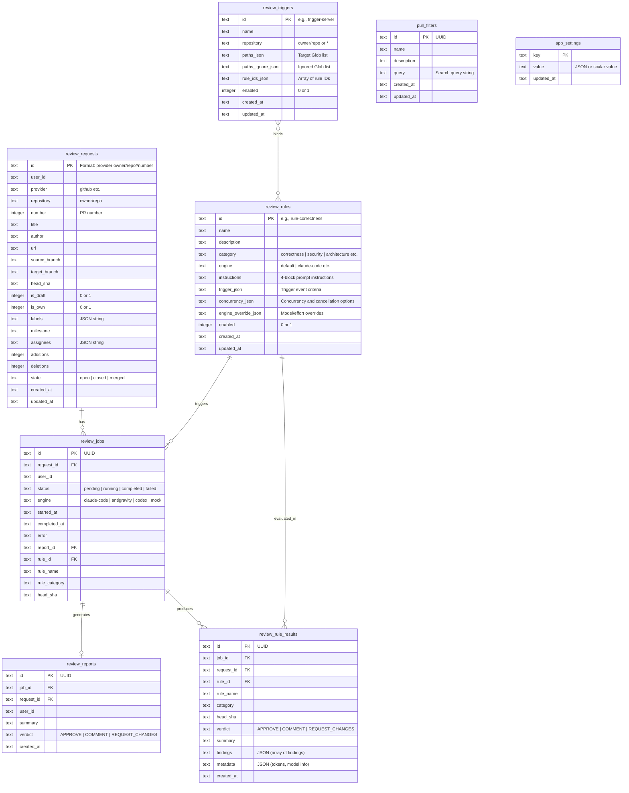
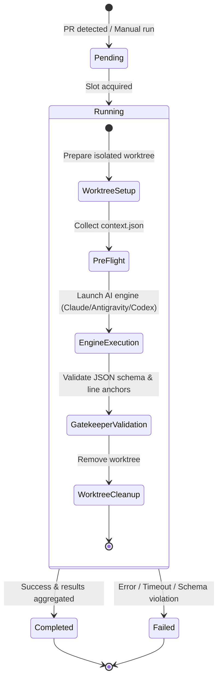

# Data Model Specification

This document defines the entity definitions, database schema (SQLite / Drizzle ORM), and review job lifecycle in `kuramori`.

---

## 1. Entity-Relationship Diagram (ERD)

---

## 2. Job State Lifecycle

Review executions are orchestrated asynchronously by `ReviewQueue` with concurrency control:

### State Definitions
- **`pending`**: Queued, awaiting an available concurrency slot (`globalMaxConcurrency`).
- **`running`**: Slot acquired; worktree initialized and AI inference executing.
- **`completed`**: Inference succeeded, Gatekeeper verified, HTML/JSON reports generated, and rule results aggregated.
- **`failed`**: Halted due to CLI error, timeout, or schema failure (details stored in `review_jobs.error` and `data/logs/<jobId>.log`).

---

## 3. Dual Storage Architecture

Review artifacts are persisted in both the database and file storage (`LocalFileReportStorage`):

1. **Database (`review_reports`, `review_rule_results`)**:
   - Stores metadata (`verdict`, `summary`, finding counts).
   - Enables fast filtering, sorting, and dashboard querying.
2. **File Storage (`data/reports/<reportId>.json`, `<reportId>.html`)**:
   - Stores complete report structures with D2 vector SVG sources, CallFlow steps, and unified diff line markers.
   - Provides standalone exportable HTML files.
