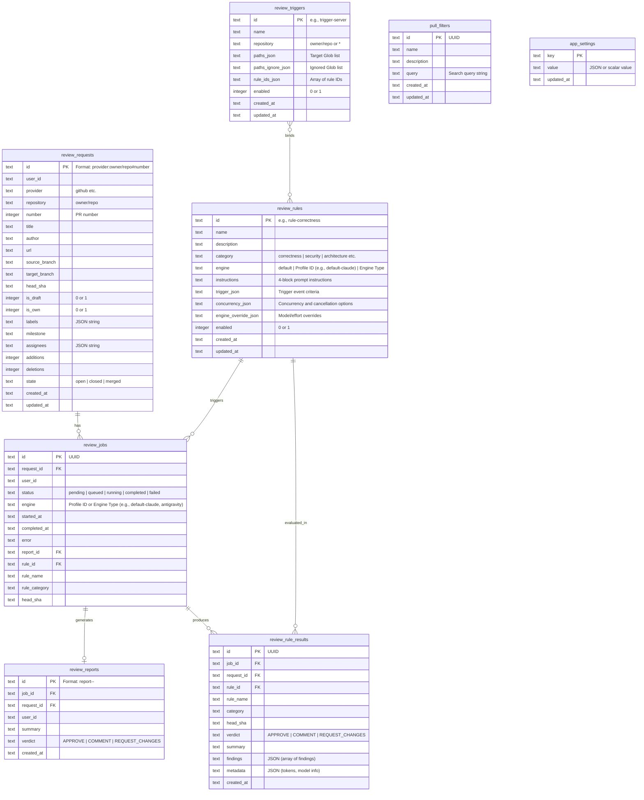
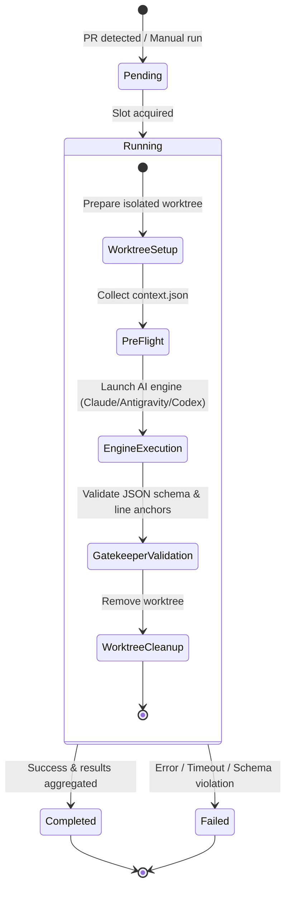
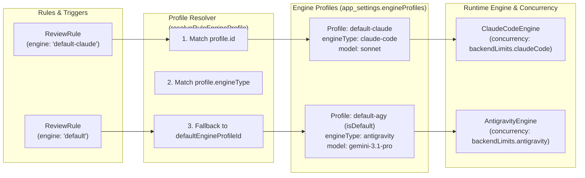

# Data Model Specification

This document defines the entity definitions, database schema (SQLite / Drizzle ORM), and review job lifecycle in `kuramori`.

---

## 1. Entity-Relationship Diagram (ERD)

---

## 2. Job State Lifecycle

Review executions are orchestrated asynchronously by `ReviewQueue` with concurrency control:

### State Definitions
- **`pending` / `queued`**: Enqueued, awaiting an available concurrency slot (`globalMaxConcurrency`).
- **`running`**: Slot acquired; worktree initialized and AI inference executing.
- **`completed`**: Inference succeeded, Gatekeeper verified, HTML/JSON reports generated, and rule results aggregated.
- **`failed`**: Halted due to CLI error, timeout, or schema failure (details stored in `review_jobs.error` and `data/logs/<jobId>.log`).

---

## 3. Dual Storage Architecture

Review artifacts are persisted in both the database and file storage (`LocalFileReportStorage`):

1. **Database (`review_reports`, `review_rule_results`)**:
   - Stores metadata (`verdict`, `summary`, finding counts).
   - Enables fast filtering, sorting, and dashboard querying.
2. **File Storage (`data/reports/<reportId>.json`, `<reportId>.html`)**:
   - Stores complete report structures including:
     - `appliedRules`: Structured execution summaries (ruleId, ruleName, category, verdict, summary, findingsCount, completedAt) for each applied rule.
     - D2 vector SVG sources (module dependencies, blast radius, StepFlow).
     - CallFlow steps and unified diff line markers.
   - Provides standalone exportable HTML files (`<reportId>.html`).

---

## 4. Engine Profiles and Execution Model

`kuramori` decouples rules and jobs from low-level engine types by introducing **Engine Profiles**:

### Profile Attributes
- **`id`**: Unique preset identifier (e.g., `default-claude`, `default-agy`, `default-codex`).
- **`engineType`**: The underlying AI runner implementation (`antigravity` | `claude-code` | `codex` | `mock`).
- **`config`**: Engine-specific configurations (binary path, model, effort, timeout, sandbox mode, custom environment variables).
- **`isDefault`**: Flag indicating the system-wide fallback profile when rules specify `engine = 'default'`.

### Resolution Strategy (`resolveRuleEngineProfile`)
1. **Active Profiles Requirement**: At least one active profile must be registered in settings. If no profiles exist, the queue throws an explicit error rather than silently executing unconfigured runners.
2. **Exact Profile ID match**: If `rule.engine` matches `profile.id` (e.g., `default-claude`), that profile is selected.
3. **Engine Type match**: If `rule.engine` matches an `engineType` (e.g., `claude-code`), the matching enabled profile (or its default instance) is selected.
4. **Default Fallback**: If `rule.engine` is `'default'` or unspecified, the profile designated by `defaultEngineProfileId` (or `isDefault === true`) is used. If the referenced profile does not exist, an explicit error is thrown.
5. **Concurrency Tracking**: Regardless of whether a job was scheduled with a profile ID (`default-claude`) or an engine name (`claude-code`), active concurrency slots are grouped and limited by the resolved `engineType`.
