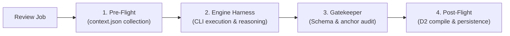

# AI Engine Specifications

This document defines the AI review engines, execution harnesses, environment layering, and profile management supported by `kuramori`.

---

## 1. Supported Engines

| Engine | Binary | Execution Method | Key Characteristics |
| :--- | :--- | :--- | :--- |
| **`claude-code`** | `claude` | CLI Harness (`claude -p`) | Uses Anthropic Claude Code. Excels at autonomous tool use and codebase exploration. |
| **`antigravity`** | `agy` | CLI Harness (`agy --new-project -p`) | Uses Google Antigravity. High-speed reasoning with extensive context capacity. |
| **`codex`** | `codex` | CLI Harness (`codex exec`) | Uses OpenAI Codex. Strict sandbox security for isolated code analysis. |
| **`mock`** | None | In-process simulation | Generates instant synthetic review reports for testing and verification. |

---

## 2. Harness Execution Pipeline

All engines are executed via the unified `RunnerPipeline` ([packages/runner/src/pipeline/runner-pipeline.ts](packages/runner/src/pipeline/runner-pipeline.ts)).



1. **Pre-Flight**: Assembles `context.json` (diff, Story/Issue acceptance criteria, comment threads, rule instructions) into the worktree.
2. **Engine Harness**: Spawns the CLI inside the isolated worktree with prompt instructions requesting structured JSON output.
3. **Gatekeeper Validation**: Validates the emitted JSON against `ReviewReportDataSchema` (Zod 4), audits finding identifier sequence (`auditCommentIds`), and verifies that commented file paths match PR changed files (`auditFileAnchors`).
4. **Post-Flight**: Compiles embedded D2 diagrams into SVG (TALA/ELK layouts) and generates standalone HTML reports.

---

## 3. Environment Layering & Secret Protection

Environment variables and credentials are dynamically layered across 4 tiers ([packages/runner/src/engines/environment.ts](packages/runner/src/engines/environment.ts)):

```text
[ 1. System Environment (Deno.env) ]
                 ↓
[ 2. Global Engine Settings ]
                 ↓
[ 3. Profile-Specific Configuration ]
                 ↓
[ 4. Run-Time Custom Environment (customEnv) ]
```

- **Secret Masking**: Variables marked with `secret: true` (API keys) are masked as empty strings `""` when returned via `GET /api/settings`. During updates (`POST /api/settings`), existing secret values are restored automatically.

---

## 4. Engine Configuration Details

### 4.1 Claude Code (`claude-code`)
- **Command structure**: `claude -p <prompt> --dangerously-skip-permissions`
- **Key options**:
  - `--model`: Model identifier (e.g., `claude-3-7-sonnet-20250219`, `ornith-1.5:9b`)
  - `--max-turns`: Limit on maximum agent-environment conversation turns
  - `--effort`: Reasoning effort level (`low`, `medium`, `high`)
  - Additional flags supported: `--append-system-prompt`, `--input-format`, `--output-format`, `--json-schema`, `--allowed-tools`, `--bare`, `customArgs`, `customEnv`

### 4.2 Google Antigravity (`antigravity`)
- **Command structure**: `agy --new-project -p <prompt> --dangerously-skip-permissions`
- **Key options**:
  - `--model`: Model identifier (e.g., `gemini-2.5-pro`)
  - `--effort`: Reasoning effort (`low`, `medium`, `high`)
  - Additional flags supported: `--print-timeout`, `--sandbox`, `--disable-slash-commands`, `--input-format`, `--output-format`, `--json-schema`, `customArgs`, `customEnv`

### 4.3 OpenAI Codex (`codex`)
- **Command structure**: `codex exec --json --sandbox <mode> --config approval_policy="never"`
- **Sandbox modes**:
  - `workspace-write` (default): Write restricted to temporary worktree.
  - `read-only`: Read-only analysis.
- **Constraints**: Dangerous flags such as `--yolo` or `--dangerously-bypass-approvals-and-sandbox` are strictly rejected by the harness.

---

## 5. Engine Profiles

Engine Profiles decouple user-facing execution configurations from low-level CLI binaries.

- **Profile ID**: Configured presets (e.g., `default-claude`, `default-agy`, `default-codex`).
- **Engine Type**: Underlying CLI runtime (`claude-code`, `antigravity`, `codex`, `mock`).
- **Rule Association & Resolution**: Review rules assign either an explicit `engineProfileId` or reference a profile by ID in `engine`. The system requires at least one active profile registered in settings; if no valid engine profile exists, or if a rule references a non-existent profile, review execution fails immediately with an explicit error rather than silently falling back to unverified defaults.
- **Diagnostics & Testing**: The system provides connection and inference verification via the Web UI (**Settings ➔ Engines**) and the API (`POST /api/engines/:engine/test`).


