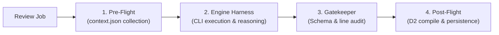

# AI Engine Specifications

This document defines the AI review engines, execution harnesses, environment layering, and local LLM integration supported by `kuramori`.

---

## 1. Supported Engines

| Engine | Binary | Execution Method | Key Characteristics |
| :--- | :--- | :--- | :--- |
| **`claude-code`** | `claude` | CLI Harness (`claude -p`) | Uses Anthropic Claude Code. Excels at autonomous tool use and codebase exploration. |
| **`antigravity`** | `agy` | CLI Harness (`agy --non-interactive`) | Uses Google Antigravity. High-speed reasoning with extensive context capacity. |
| **`codex`** | `codex` | CLI Harness (`codex exec`) | Uses OpenAI Codex. Strict sandbox security for isolated code analysis. |
| **`mock`** | None | In-process simulation | Generates instant synthetic review reports for testing and verification. |

---

## 2. Harness Execution Pipeline

All engines are executed via the unified `RunnerPipeline` ([packages/runner/src/pipeline/runner-pipeline.ts](packages/runner/src/pipeline/runner-pipeline.ts)).



1. **Pre-Flight**: Assembles `context.json` (diff, Story/Issue acceptance criteria, comment threads, rule instructions) into the worktree.
2. **Engine Harness**: Spawns the CLI inside the isolated worktree with prompt instructions requesting structured JSON output.
3. **Gatekeeper Validation**: Validates the emitted JSON against `ReviewReportDataSchema` (Zod 4) and audits that commented line numbers actually exist in the diff.
4. **Post-Flight**: Compiles embedded D2 diagrams into SVG (TALA/ELK layouts) and generates standalone HTML reports.

---

## 3. Environment Layering & Secret Protection

Environment variables and credentials are dynamically layered across 4 tiers ([packages/runner/src/engines/environment.ts](packages/runner/src/engines/environment.ts)):

```text
[ 1. System Environment (Deno.env) ]
                 ↓
[ 2. Global Engine Settings ]
                 ↓
[ 3. Profile-Specific Configuration ]
                 ↓
[ 4. Run-Time Custom Environment (customEnv) ]
```

- **Secret Masking**: Variables marked with `secret: true` (API keys) are masked as empty strings `""` when returned via `GET /api/settings`. During updates (`POST /api/settings`), existing secret values are restored automatically.

---

## 4. Engine Configuration Details

### 4.1 Claude Code (`claude-code`)
- **Command structure**: `claude -p <prompt> --dangerously-skip-permissions`
- **Key options**:
  - `--model`: Model identifier (e.g., `claude-3-7-sonnet-20250219`, `ornith-1.5:9b`)
  - `--max-turns`: Limit on maximum agent-environment conversation turns

### 4.2 Google Antigravity (`antigravity`)
- **Command structure**: `agy --non-interactive`
- **Key options**:
  - `--model`: Model identifier (e.g., `gemini-2.5-pro`)
  - `--effort`: Reasoning effort (`low`, `medium`, `high`)

### 4.3 OpenAI Codex (`codex`)
- **Command structure**: `codex exec --json --sandbox <mode> --config approval_policy="never"`
- **Sandbox modes**:
  - `workspace-write` (default): Write restricted to temporary worktree.
  - `read-only`: Read-only analysis.
- **Constraints**: Dangerous flags such as `--yolo` are strictly rejected by the harness.

---

## 5. Local LLM Integration (Ollama)

Run open-weights models (`ornith-1.5:9b`, `qwen2.5-coder:14b`) on local GPUs (e.g., RTX 5080 with 16GB VRAM).

### Architecture
- **Inference Server**: Ollama (`http://localhost:11434`)
- **Protocol**: Direct Anthropic Messages API (`/v1/messages`) compatibility natively supported by Ollama. No intermediate proxy needed.

### Verification Command
```bash
deno task verify:local-llm --url http://localhost:11434 --model ornith-1.5:9b
```

### Review Execution Command
```bash
deno task runner \
  --repo owner/repo \
  --pr 123 \
  --engine claude-code \
  --model ornith-1.5:9b \
  --api-base-url http://localhost:11434
```
