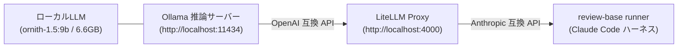

# ローカルLLM（非プロバイダーAIエンジン）連携ガイド

本ドキュメントでは、RTX 5080（16GB VRAM）などのローカル GPU 環境で Ollama や vLLM 等のオープンソース推論サーバーを稼働させ、`review-base` の自律レビューエンジンとして実行するためのセットアップ手順を解説する。

---

## 1. アーキテクチャ概要



- **ハーネス層**: ワークツリー巡回や自律探索ループ、Gatekeeper 検収には既存の Claude Code ハーネスを利用。
- **推論プロキシ層**: Ollama の OpenAI 互換 API を LiteLLM Proxy を介して Anthropic 形式へ中継。
- **モデル**: 16GB VRAM 環境に最適な **`ornith-1.5:9b`**（6.6GB、256K コンテキスト長、自律エージェント特化モデル）を採用。

---

## 2. セットアップ手順

### ステップ 1: Ollama でモデルを pull & 起動

Ollama が稼働している環境でモデルをダウンロードする：

```bash
ollama pull ornith-1.5:9b
```

> [!TIP]
> 14B クラスの別モデルを試す場合は `ollama pull qwen2.5-coder:14b` または `ollama pull qwen3:14b` を利用可能。

### ステップ 2: LiteLLM Proxy の起動

リポジトリ直下の `scripts/litellm_config.yaml` を指定して LiteLLM Proxy を起動する（ポート 4000）：

```bash
# uv / uvx を利用する場合（推奨）
uvx litellm --config scripts/litellm_config.yaml --port 4000

# または pip / python を利用する場合
pip install 'litellm[proxy]'
litellm --config scripts/litellm_config.yaml --port 4000
```

### ステップ 3: 接続検証スクリプトの実行

`review-base` に同梱されている検証タスクを実行し、推論サーバーとの疎通を確認する：

```bash
deno task verify:local-llm --url http://localhost:4000 --model ornith-1.5:9b
```

正常に接続されると、テストプロンプトへの応答と実行コマンド例が出力される。

---

## 3. レビューの実行

### CLI からの単体実行

`review-runner` に `--engine claude-code` と `--api-base-url`、`--model` を指定して実行する：

```bash
deno task runner \
  --repo <owner/repo> \
  --pr <PR番号> \
  --engine claude-code \
  --model ornith-1.5:9b \
  --api-base-url http://localhost:4000
```

VRAM の安全制限としてターン数を制限したい場合は `--max-turns` オプションを追加可能：

```bash
deno task runner \
  --repo <owner/repo> \
  --pr <PR番号> \
  --engine claude-code \
  --model ornith-1.5:9b \
  --api-base-url http://localhost:4000 \
  --max-turns 15
```

### Web UI / バックエンド設定からの利用

1. ブラウザで [http://localhost:3456](http://localhost:3456) を開く。
2. **設定** ➔ **AI エンジン設定** ➔ **Claude Code** を開く。
3. 以下の項目を設定：
   - **Model**: `ornith-1.5:9b`
   - **API Base URL**: `http://localhost:4000`
4. PR 一覧から「レビュー開始」を実行すると、ローカル推論基盤による自律探索レビューが実行される。
