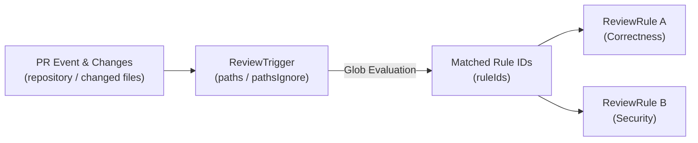

# Review Rules & Triggers Guide

This document defines how review rules (`ReviewRule`) and triggers (`ReviewTrigger`) operate, their matching logic, and the standardized 4-block instruction format in `kuramori`.

---

## 1. Decoupled Architecture

`kuramori` strictly separates **what to review (Rule)** from **when and where to review (Trigger)**:



- **`ReviewRule`**: Defines quality criteria (`instructions`), category (`category`), concurrency options, and engine overrides. Reusable across repositories.
- **`ReviewTrigger`**: Binds a repository (`repository`) and file glob patterns (`paths`, `pathsIgnore`) to a set of rule IDs (`ruleIds`).

---

## 2. Path Matching Logic & Trigger Resolution

Triggers are evaluated against PR changed files according to these precedence rules ([packages/runner/src/pipeline/rule-matcher.ts](packages/runner/src/pipeline/rule-matcher.ts)):

1. **Repository Match**:
   - `trigger.repository` must match the PR's `owner/repo` exactly, or be the wildcard `*` (matching all repositories).
2. **Target Filter (`paths`)**:
   - If `paths` is defined and non-empty, at least one changed file must match a glob in `paths` (e.g., `apps/server/**`, `**/auth/**`).
3. **Ignore Filter (`pathsIgnore`)**:
   - If `pathsIgnore` is defined and non-empty, the trigger is skipped only if **all** changed files match the ignore patterns (e.g., all changed files are `**/*.test.ts` or `**/docs/**`).
4. **No Silent Fallback (Explicit Error on Empty Rules)**:
   - When a PR has no matching rules or enabled triggers, the queue does not silently fall back to default rules. Instead, it throws an explicit error (`実行対象のレビュールールがありません`) to avoid running untracked or unwanted reviews.

---

## 3. The 4-Block Instruction Template

To eliminate superficial noise and produce actionable findings, review rule instructions must follow this **4-block layout**:

```markdown
=== 1. SCOPE & OBJECTIVE ===
Define the responsibility of this rule and the quality goals it safeguards in 1-2 concise sentences.

=== 2. KEY SMELLS & FAILURE MODES ===
Bullet points highlighting anti-patterns and failure modes specific to this stack and directory:
- [Smell 1]: Specific code pattern, vulnerability, or invariant breach.
- [Smell 2]: Edge cases, transaction omissions, or concurrency pitfalls.
- [Smell 3]: Hardcoded credentials, logging violations, or typing escapes.

=== 3. VERIFICATION PROTOCOL ===
Actionable investigation steps the reviewer MUST perform inside the worktree beyond the diff:
1. Search caller sites (callers) via grep to verify that signature or contract changes do not break existing call sites.
2. Inspect related interfaces, type definitions, and schema validators.
3. Check for boundary value tests (0, empty arrays, null/undefined, error paths).

=== 4. NOISE FILTER (STRICTLY PROHIBITED) ===
Explicitly forbid review feedback that causes fatigue:
- Do NOT comment on formatting, whitespace, or stylistic nits automatically handled by linters/formatters.
- Do NOT challenge decisions already discussed or intentional in the PR description / existing comments.
- Do NOT provide abstract complaints without concrete suggestion snippets.
```

---

## 4. Built-in Preset Rules

The system pre-seeds three foundational rules designed with the 4-block layout:

- **`preset-correctness`** (`correctness`): Verifies business invariants, boundary values, error propagation, and caller compatibility.
- **`preset-security`** (`security`): Detects authentication/authorization gaps, injection vectors, credentials in code, and secret exposure.
- **`preset-architecture`** (`architecture`): Enforces boundary contracts between packages and apps, detects circular imports, and verifies layer isolation.

---

## 5. Multi-Rule Aggregation & `appliedRules`

When multiple rules match a PR, `kuramori` executes review jobs concurrently and aggregates the results through `Aggregator` ([apps/server/src/aggregator.ts](apps/server/src/aggregator.ts)):

1. **Overall Verdict Resolution**: `REQUEST_CHANGES` > `COMMENT` > `APPROVE`. If any rule requests changes, the overall PR review requests changes.
2. **Comment ID Renumbering**: Findings across all rules are merged and sequentially re-indexed (`C1`, `C2`, ...).
3. **Structured `appliedRules` Record**: The resulting `ReviewReportData` preserves an `appliedRules` array summarizing each executed rule:
   - `ruleId`: Unique ID of the rule.
   - `ruleName`: Human-readable name.
   - `category`: Rule category (`correctness`, `security`, `architecture`, etc.).
   - `verdict`: Individual verdict produced by that rule.
   - `summary`: Concise summary of rule findings.
   - `findingsCount`: Number of comments/issues reported by that rule.
   - `completedAt`: ISO 8601 completion timestamp.
4. **Dashboard Badges**: The web UI displays interactive rule badges and individual summaries in the report header.
