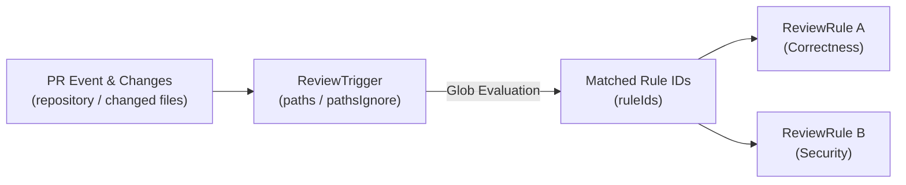

# Review Rules & Triggers Guide

This document defines how review rules (`ReviewRule`) and triggers (`ReviewTrigger`) operate, their matching logic, and the standardized 4-block instruction format in `kuramori`.

---

## 1. Decoupled Architecture

`kuramori` strictly separates **what to review (Rule)** from **when and where to review (Trigger)**:



- **`ReviewRule`**: Defines quality criteria (`instructions`), category (`category`), concurrency options, and engine overrides. Reusable across repositories.
- **`ReviewTrigger`**: Binds a repository (`repository`) and file glob patterns (`paths`, `pathsIgnore`) to a set of rule IDs (`ruleIds`).

---

## 2. Path Matching Logic

Triggers are evaluated against PR changed files according to these precedence rules ([packages/runner/src/pipeline/rule-matcher.ts](packages/runner/src/pipeline/rule-matcher.ts)):

1. **Repository Match**:
   - `trigger.repository` must match the PR's `owner/repo` exactly, or be the wildcard `*` (matching all repositories).
2. **Ignore Filter (`pathsIgnore`)**:
   - If a file matches any glob pattern in `pathsIgnore` (e.g., `**/*.test.ts`, `**/docs/**`), it is excluded from triggering.
3. **Target Filter (`paths`)**:
   - If `paths` is omitted or empty, all non-ignored files trigger the rule.
   - If `paths` is defined, at least one non-ignored changed file must match a glob in `paths` (e.g., `apps/server/**`, `**/auth/**`).

---

## 3. The 4-Block Instruction Template

To eliminate superficial noise and produce actionable findings, review rule instructions must follow this **4-block layout**:

```markdown
=== 1. SCOPE & OBJECTIVE ===
Define the responsibility of this rule and the quality goals it safeguards in 1-2 concise sentences.

=== 2. KEY SMELLS & FAILURE MODES ===
Bullet points highlighting anti-patterns and failure modes specific to this stack and directory:
- [Smell 1]: Specific code pattern, vulnerability, or invariant breach.
- [Smell 2]: Edge cases, transaction omissions, or concurrency pitfalls.
- [Smell 3]: Hardcoded credentials, logging violations, or typing escapes.

=== 3. VERIFICATION PROTOCOL ===
Actionable investigation steps the reviewer MUST perform inside the worktree beyond the diff:
1. Search caller sites (callers) via grep to verify that signature or contract changes do not break existing call sites.
2. Inspect related interfaces, type definitions, and schema validators.
3. Check for boundary value tests (0, empty arrays, null/undefined, error paths).

=== 4. NOISE FILTER (STRICTLY PROHIBITED) ===
Explicitly forbid review feedback that causes fatigue:
- Do NOT comment on formatting, whitespace, or stylistic nits automatically handled by linters/formatters.
- Do NOT challenge decisions already discussed or intentional in the PR description / existing comments.
- Do NOT provide abstract complaints without concrete suggestion snippets.
```

---

## 4. Recommended Review Categories

| Category | Typical Path Patterns | Key Verification Focus |
| :--- | :--- | :--- |
| **`security`** | `**/auth/**`, `**/api/**`, `**/server/**` | Authentication, authorization, IDOR, secrets leakage, input sanitization |
| **`integrity`** | `**/db/**`, `**/schema/**`, `**/migrations/**` | Transaction boundaries, N+1 queries, schema backward compatibility |
| **`correctness`** | `**/domain/**`, `**/services/**`, `**/core/**` | Business invariants, edge cases, caller regression, error handling |
| **`architecture`** | `packages/**`, `apps/**` | Unidirectional layer dependencies, circular import prevention, module coupling |
| **`frontend`** | `apps/web/**`, `**/components/**` | Unnecessary re-renders, accessibility, state synchronization races |
